# Minecraft_Meta

---

작성자 : 오도경

궁금한 점 있을 시 Issue 남겨주시면 친절히 답변해드립니다!

# 목차

- [개요](#개요)
    * [작성 의의](#작성-의의)
    * [소개](#소개)
        + [함께 사용된 라이브러리](#함께-사용된-라이브러리)
        + [문서 내용](#문서-내용)
- [Part 1. 구현 기능 요약](#part-1-구현-기능-요약)
    * [구현된 기능 리스트](#구현된-기능-리스트)
        + [인벤토리](#젤리)
        + [지형 생성](#젤리팜-메인-ui)
        + [밤/낮, 그림자, 구름 구현](#밤낮-그림자-구름-구현)
- [Part 2. Chunk 생성 소개](#part-2-chunk-생성-소개)
    + [Mesh 생성](#mesh-생성)
      + [Mesh란?](#mesh란)
      + [사각형(쿼드) 생성](#사각형쿼드-생성)
      + [정육면체 생성](#정육면체-생성)
    + [Chunk 생성](#chunk-생성-)
      + [Chunk란?](#chunk란)
      + [Chunk를 사용하는 이유](#chunk를-사용하는-이유)
      + [Chunk 생성하는 법](#chunk-생성하는-법)
      + [Chunk 생성 시 발생한 문제](#chunk-생성-시-발생한-문제)
      + [Face Culling](#face-culling)
- [Part 3. Perlin Noise 소개](#part-3-perlin-noise-소개)
    * [Perlin Noise란 무엇인가?](#perlin-noise란-무엇인가)
    * [지형 생성에 Perlin Noise를 쓰는 이유](#지형-생성에-perlin-noise를-쓰는-이유)
- [Part 4. 최적화 기법 분석](#part-4-최적화-기법-분석)
    * [왜 최적화가 필요한가](#왜-최적화가-필요한가)
    * [지형 생성 최적화 구조](#지형-생성-최적화-구조)
    * [UniTask를 사용해 구현한 이유](#unitask를-사용해-구현한-이유)
- [더 나아가서 고민해볼 것](#더-나아가서-고민해볼-것)

---

# 개요

## 작성 의의

마인크래프트(Minecraft)를 모작하면서 구현한 기능에 대해 소개하고 무한 지형 동적 생성 로직 방법을 공유한다.

## 소개

### 함께 사용된 라이브러리

1. UniTask

### 문서 내용

Part 1. 구현 기능 요약에서는 마인크래프트를 모작하면서 구현한 기능에 대해 소개한다.

Part 2. Chunk 생성 소개에서는 우리가 생성하고자 하는 Chunk에서 적용된 기술들과 왜 그 기술들을 사용했는지 소개한다. 

Part 3. Perlin Noise 소개에서는 Perlin Noise의 기술의 소개와 기술을 왜 사용하는지 소개한다.

Part 4. 최적화 기법 분석에서는 Chunk를 생성하였을 때 발생하는 프레임 드랍을 어떤 방식으로 해결했는지 소개한다.

---

# Part 1. 구현 기능 요약

[Minecraft_Meta 시연 영상](https://www.youtube.com/watch?v=Wo-oBvjLJ2I)

본 프로젝트는 Minecraft의 크리에이티브 모드를 바탕으로 모작하였다.

플레이어 이동, 인벤토리, 블록 설치/제거, 지형 동적 생성 기능을 구현하였다.

모든 기능을 구현하지 않고 핵심 로직 위주로만 구현되었다.

## 구현된 기능 리스트

아래 소개할 내용은 프로젝트에서 구현되어 있는 기능 목록들이다.

### 인벤토리

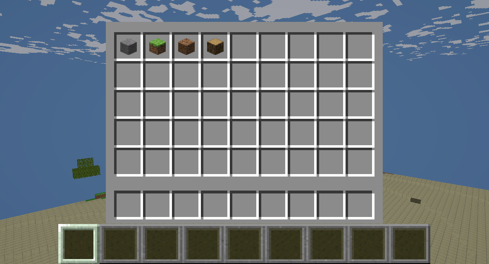

**인벤토리**

- 인벤토리 슬롯
- 툴바 슬롯

**드래그 기능**
- 슬롯에 있는 블록을 마우스로 드래그하면:
  - 마우스를 이용해서 인벤토리 슬롯에 있는 블록을 툴바로 이동
  - 필드 밖으로 드래그 시 이동 취소

**블록 설치**

- 1 ~ 9번까지의 키를 눌러 해당 숫자의 툴바 슬롯을 액티브
- 액티브 된 슬롯에 블록이 존재하면 마우스 왼쪽 클릭으로 설치

### 지형 생성
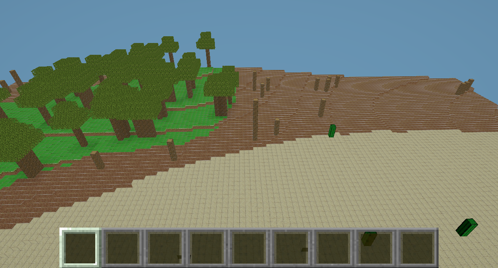
**바이옴 별 지형 생성**

- 지형이 동적으로 생성될 때 랜덤 바이옴에 맞게 생성
  - 숲 지형
  - 황무지 지형
  - 사막 지형

**구조물 생성**

- 각 지형에 맞는 구조물 생성
  - 숲 지형에는 나무
  - 황무지 진형에는 말라죽은 나무
  - 사막 지형에는 선인장

### 밤/낮, 그림자, 구름 구현
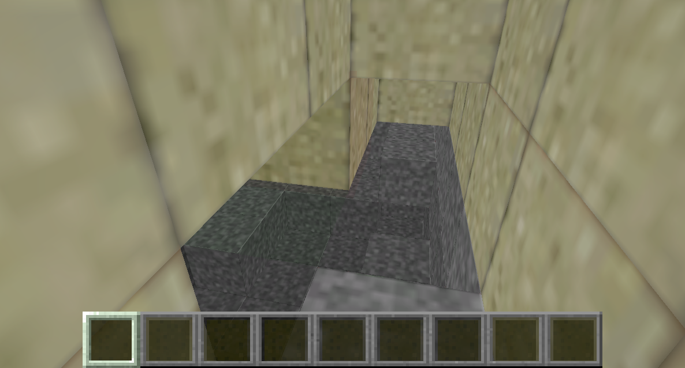

**그림자(광 전파) 생성**
- 블록이 빛과 멀어질수록 그림자가 짙어짐.

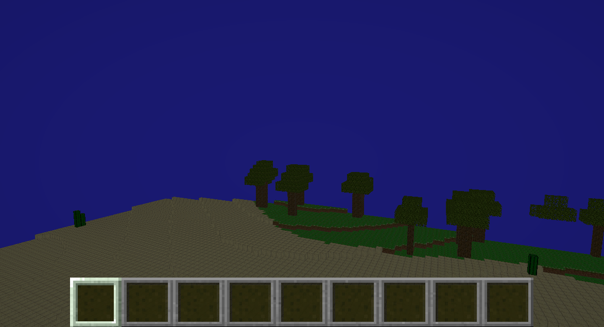

**밤/낮 구현(주야 사이클)**
- 5분 간격으로 밤/낮 변화

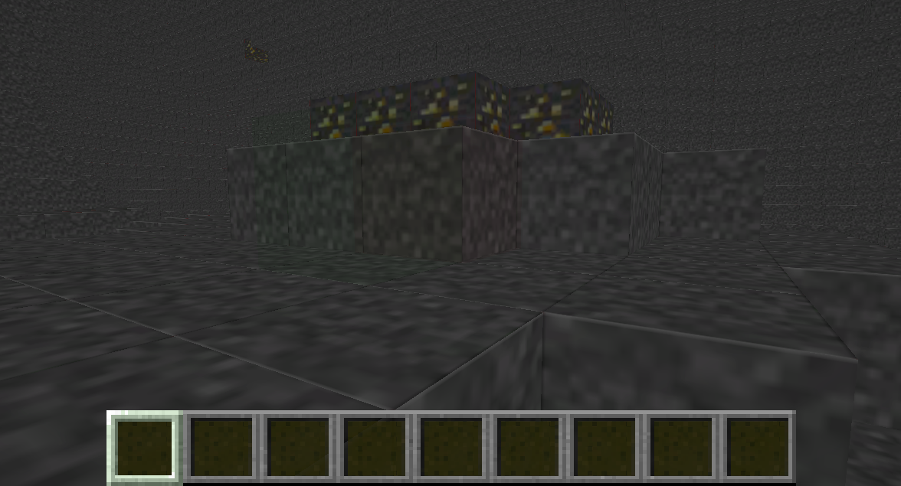

**광산 내 랜덤 광물 및 동굴 생성**
- 석탄
- 금
- 모래
- 흙
- 다이아몬드
- 철

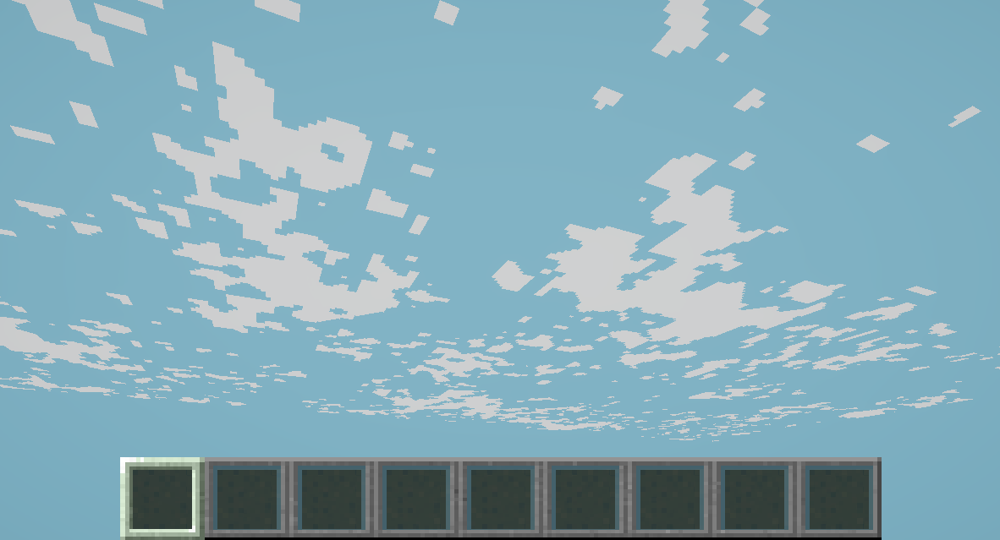

### 구름 구현
- 플레이어 위치를 탐색해 생성된 구름이 이동해 무한으로 생성된 느낌을 줌

---

# Part 2. Chunk 생성 소개

본 문서의 목표는 Chunk 생성에 대한 이해다.
필자는 직접 런타임 도중에 Mesh를 생성하였다.
고로 본 내용에 들어가기 전에 Mesh의 생성 원리에 대해 먼저 소개하고 넘어가고자 한다.


## Mesh 생성
### Mesh란?

GPU가 화면에 그릴 수 있도록 기하(geometry)를 수치로 표현한 데이터 묶이다.

Unity에서 하나의 Mesh는 아래 다섯 가지 핵심 배열로 구성된다.
- Vertices
- Triangles
- Uvs
- Normals
- Colors(선택)

여기서 드는 근본적인 질문은, 왜 Mesh에는 이 데이터들이 필요한가이다. 

현대 GPU의 래스터라이즈(3D 장면을 모니터 화면의 픽셀 그리드로 바꿔서 칠하는 과정)은 삼각형을 화면에 칠하는 기계이다.


오브젝트의 곡면도 결국 아주 많은 작은 삼각형으로 근사한다. 그 과정에서 GPU가 한 프레임을 그리려면 그리려면 다음이 필요하다.
1. 어떤 점(정점)들이 있는가? -> Vertices
2. 그 정점들 중 어떤 셋을 엮어 삼각형을 만들 것인가 -> Triangles
3. 각 삼각형의 각 픽셀에서 텍스쳐/조명을 어떻게 계산할 것인가?
-> 이를 위해 정점마다 부가 속성을 싣고, 삼각형 내부에서는 그 속성을 보간한다: Uvs,Normals,Colors

### 사각형(쿼드) 생성


**정점 배치**
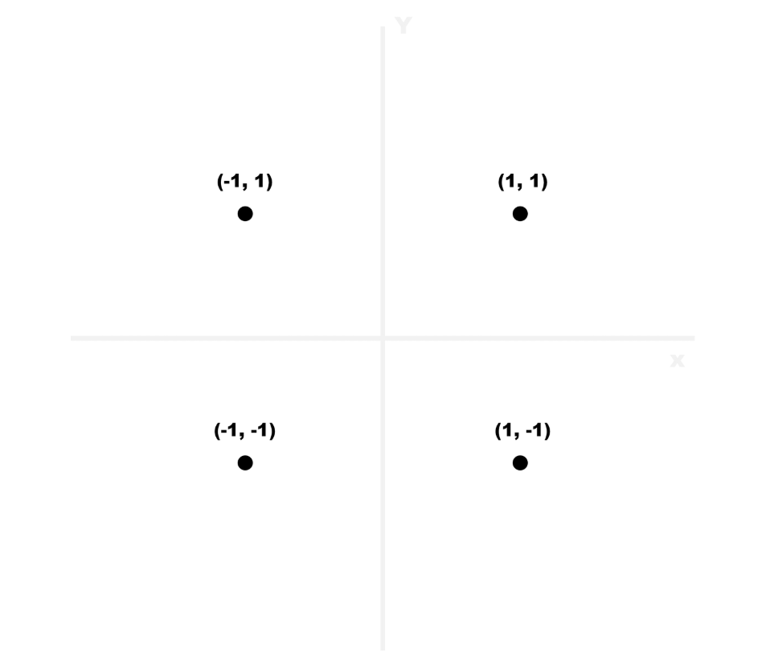
2차원 공간에서 사각형(Quad) 모델을 만든다고 하면 네 개의 정점(Vertice)을 지정해야 한다.

시계 방향으로 왼쪽 아래부터 오른쪽 아래까지 돌면서 정점 배열을 생성했다고 하자.

그러면, {(-1,-1), (-1, 1), (1, 1), (1, -1)} 순서로 구성이 된다.


**삼각형 설정**
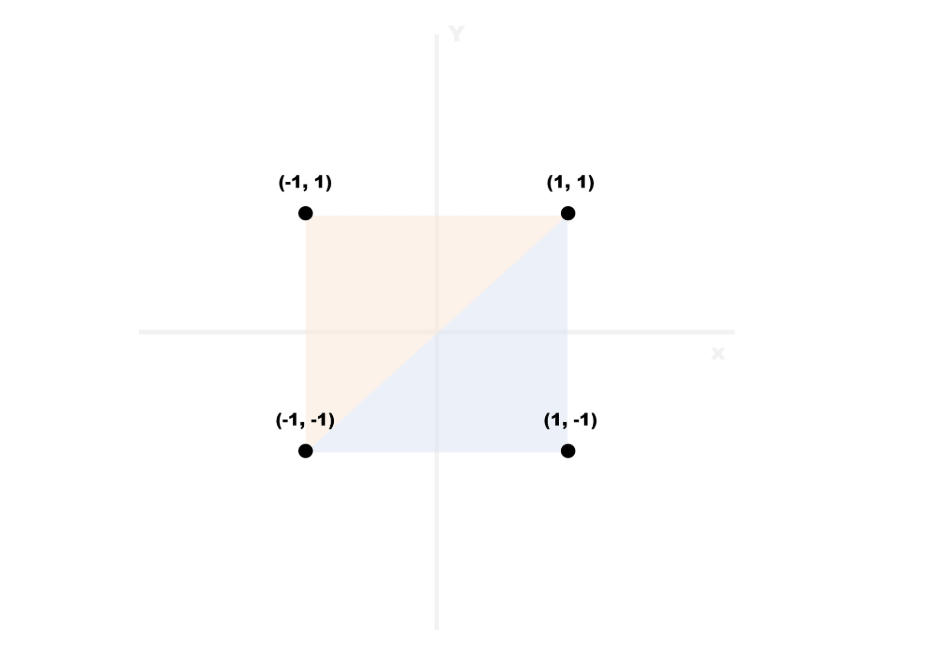
그 다음으로 이 정점들을 이용해서 면을 만들어내야 한다.

면은 기본적으로 삼각형(Triangle)의 연속으로 만들어진다. 사각형은 두 개의 삼각형으로 만들 수 있을 것이다.


아까 만든 배열의 인덱스를 기준으로 생성하면, {0, 1, 2, 2, 3, 0}이 된다.

**UV 설정**
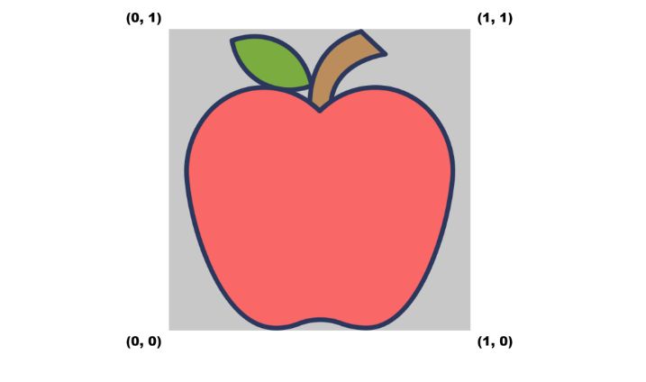
텍스쳐의 좌표계를 UV라고 하는데, 가로 (U) 세로 (V) 모두 0~1 사이의 값이다.

(0, 0)이면 텍스쳐의 왼쪽 아래고, (1, 1)이면 텍스쳐의 오른쪽 위다.

이는 텍스쳐의 비율이나 해상도에 따라 달라지지 않는다.
각 정점에 UV 좌표를 지정하면, 정점 사이를 보간하여 면에 텍스쳐를 입히게 된다.

왼쪽 아래부터 시계방향으로 돌면서 정점 배열을 생성했으므로 {(0,0), (0,1), (1, 1), (1,0)} 순서로 UV 배열을 생성할 수 있다.

### 정육면체 생성

정육면체는 사각형을 6번 생성했다고 보면 된다.

**VoxelData.cs**
```csharp
    //정점 생성
    public static readonly Vector3[] VoxelVertes =
    {
        new(0.0f, 0.0f, 0.0f),
        new(1.0f, 0.0f, 0.0f),
        new(1.0f, 1.0f, 0.0f),
        new(0.0f, 1.0f, 0.0f),
        new(0.0f, 0.0f, 1.0f),
        new(1.0f, 0.0f, 1.0f),
        new(1.0f, 1.0f, 1.0f),
        new(0.0f, 1.0f, 1.0f),
    };
    
    //삼각형 인덱스 설정
    public static readonly int[,] VoxelIndex =
    {
        //앞면
        {0, 3, 1, 2},
        //뒷면
        {5, 6, 4, 7},
        //윗면
        {3, 7, 2, 6},
        //아랫면
        {1, 5, 0, 4},
        //왼쪽면
        {4, 7, 0, 3},
        //오른쪽면
        {1, 2, 5, 6},
    };
```
**Chunk.cs**
```csharp
    //Mesh에 생성된 데이터 설정(설명을 위해 초기 코드를 가져왔습니다.)
    public void CreateMesh()
    {
        Mesh mesh = new();
        mesh.vertices = _vertices.ToArray();
        mesh.SetTriangles(_indices.ToArray(), 0);
        mesh.uv = _uvs.ToArray();
        _meshFilter.mesh = mesh;
        _meshCollider.sharedMesh = _meshFilter.mesh;
    }
```
위의 코드는 정육면체에 관련된 정보(vertices, triangles, uv)를 통해 mesh를 만드는 과정이다.

## Chunk 생성 
### Chunk란?
Chunk = 지형(Terrain)을 잘게 쪼갠 작은 블록 단위.

마인크래프트에선 16x256x16 블록(가로x높이x세로) 한 덩어리를 하나의 메쉬로 관리한다.

### Chunk를 사용하는 이유
거대한 지형을 작은 독립 단위로 쪼개서 로딩, 렌더링, 저장, 수정을 국소화하기 위해서다. 지형을 무한으로 보이게 만들려면, 플레이어 주변만 빠르게 생성,표시하고 멀어진 곳은 치워야 합니다.

이때 "블록 하나씩"을 관리하면 드로우콜과 메모리,CPU 비용이 폭발한다. 반대로 16x256x16 Chunk로 묶으면, 한 Chunk를 메시 1개로 렌더링할 수 있고, 플레이어가 이동할 때도 반경 r개의 모양으로 청크를 스트리밍하면 된다.

즉 화면에 필요한 몇 백 개 청크만 메모리에 두고 나머지는 디스크나 생성 대기 상태로 돌려놓을 수 있다.

### Chunk 생성하는 법
마인크래프트 기준인 16x256x16 블록(가로x높이x세로) 한 덩어리를 하나의 메쉬에 넣어 만들면 된다.

**Chunk.cs**
```csharp
// 16x256x16 for 문을 돌며 Cube Data 생성
void CreateMeshData () {
    for (int y = 0; y < 256; y++) {
        for (int x = 0; x < 16; x++) {
            for (int z = 0; z < 16; z++) {
                AddVoxelDataToChunk (new Vector3(x, y, z));
        }
    }
}
// Mesh와 관련된 배열 데이터 생성
void AddVoxelDataToChunk (Vector3 pos) {
for (int p = 0; p < 6; p++) {
    if (!CheckVoxel(pos + VoxelData.faceChecks[p])) {
        vertices.Add (pos + VoxelData.voxelVerts [VoxelData.voxelTris [p, 0]]);
        vertices.Add (pos + VoxelData.voxelVerts [VoxelData.voxelTris [p, 1]]);
        vertices.Add (pos + VoxelData.voxelVerts [VoxelData.voxelTris [p, 2]]);
        vertices.Add (pos + VoxelData.voxelVerts [VoxelData.voxelTris [p, 3]]);
        uvs.Add (VoxelData.voxelUvs [0]);
        uvs.Add (VoxelData.voxelUvs [1]);
        uvs.Add (VoxelData.voxelUvs [2]);
        uvs.Add (VoxelData.voxelUvs [3]);
        triangles.Add (vertexIndex);
        triangles.Add (vertexIndex + 1);
        triangles.Add (vertexIndex + 2);
        triangles.Add (vertexIndex + 2);
        triangles.Add (vertexIndex + 1);
        triangles.Add (vertexIndex + 3);
        vertexIndex += 4;

        }
    }
}
// 배열 데이터로 하나의 Mesh 생성
void CreateMesh () {
    Mesh mesh = new Mesh ();
    mesh.vertices = vertices.ToArray ();
    mesh.triangles = triangles.ToArray ();
    mesh.uv = uvs.ToArray ();
    mesh.RecalculateNormals ();
    meshFilter.mesh = mesh;
}
```
### Chunk 생성 시 발생한 문제
청크(16×256×16) 안의 모든 블록 면을 전부 생성한다고 가정하면, 블록 1개 = 면 6개 × (면당 정점 4개) = 정점 24개 이므로

총 정점 수 = 16 × 256 × 16 × 24 = 1,572,864개

총 삼각형 수 = (면 6개 × 삼각형 2개) × 65,536블록 = 786,432개


Unity의 기본 Mesh 인덱스는 16비트(0~65,535)라서 한 Mesh에 정점 65,535개까지만 담을 수 있다.

물론 32비트 인덱스로 바꾸면 한 Mesh에 더 많이 넣을 수 있긴 하지만 성능 문제가 심각해진다.

대략적인 버퍼 비용만 봐도 :
* position(12B) + normal(12B) + uv(8B) + color(16B) ≈ 48B/정점 
* 1,572,864 × 48B ≈ 75MB (정점 버퍼만)
* 인덱스(4B × 3 × 786,432) ≈ 9MB
→ 청크 1개가 이 정도면, 업로드·드로우·메모리 모두 감당 불가 수준.

그래서 필자는 Face Culling 기술을 이용한다.

### Face Culling
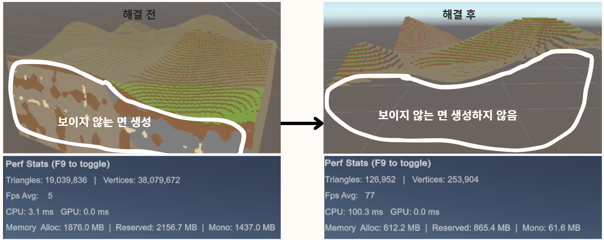
Face Culling이란 각 블록의 6면을 검사해 이웃이 "Air(비가시)" 일 때만 그 면을 메시에 추가하는 기술을 말한다.
이렇게 하면 보이지 않는 면(내부면)이 사라져 정점, 삼각형 수가 수십 배 줄어든다.

# Part 3. Perlin Noise 소개
마인크래프트(Minecraft)의 지형 생성 방식을 검색하면 가장 먼저 등장하는 것이 바로 Perlin Noise이다. 

하지만 검색 결과를 보면 이렇게 설명되어 있다.
* “연속적인 일련의 의사 난수 값을 생성하는 알고리즘으로, 유기적인 형태의 노이즈를 만들어낸다.”

이 문장을 그대로 읽으면 대부분은 ‘이게 도대체 무슨 말이지?’ 싶을 것이다.
그래서 여기서는 Perlin Noise를 누구나 이해할 수 있는 방식으로 설명해보려고 한다.

## Perlin Noise란 무엇인가?
Perlin Noise는 한마디로 “부드러운 랜덤값”이다.

우리가 흔히 생각하는 랜덤(Random) 은 완전히 들쭉날쭉하다.
만약 이런 완전한 랜덤으로 지형을 만들면…

어떤 곳은 갑자기 산이 솟고

바로 옆은 갑자기 깊은 웅덩이가 생기고

전체적으로 울퉁불퉁하고 끊어진 지형이 된다

즉, 자연과는 전혀 다른 이상한 지형이 만들어진다.

Perlin Noise는 이런 랜덤값을 부드럽게 이어붙인 랜덤이다.
그래서 값이 급격하게 변하지 않고 곡선처럼 자연스럽게 변화한다.

## 지형 생성에 Perlin Noise를 쓰는 이유

### 언덕 생성
아래 그림과 같이 Perlin Noise 값을 Y 높이로 사용하면,

→ 완만한 언덕과 산처럼 자연스러운 곡선 형태가 만들어진다.
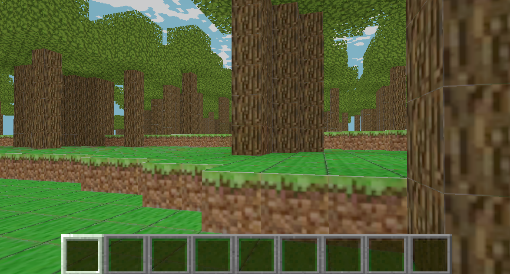
### 바이옴(biome) 구분
Perlin Noise는 지형 높이뿐 아니라 바이옴(생물군계) 결정에도 사용된다.

아래처럼 생각할 수 있다:

만약 노이즈 값이 0.6 이상이면 사막

0.6 미만이면 숲

이렇게 임계값을 기준으로 적절히 나누기만 해도,

→ 사막이 쭉 이어지다가 점점 숲으로 넘어가는 자연스러운 지형이 만들어진다.
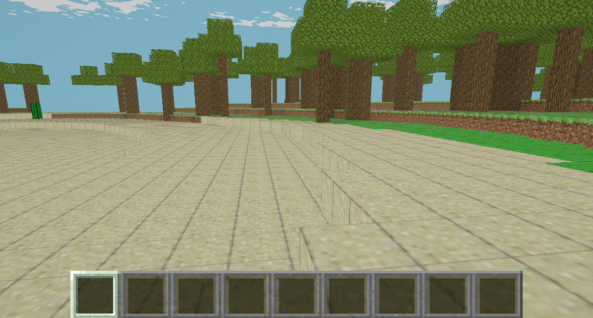

# Part 4. 최적화 기법 분석

## 왜 최적화가 필요한가
한 청크는 16x256x16 = 65,536 이다.
메시 빌드 단계에서 각 복셀의 6면을 검사하고(Face Culling), 텍스쳐, 노말, 라이트 데이터를 쌓는다.

여기에 빛 계산까지 더하면, 청크 하나만으로도 수만 회 연산이 기본이고, 플레이어 주변 다수 청크가 동시에 갱신되면 프레임 스파이크가 바로 체감된다.

Unity는 모든 렌더링 API 접근이 메인 스레드 한정이기 때문에 

"계산(메시 빌더/라이트 전파)"는 백그라운드로 밀어내고,

"Mesh 적용(MeshFilter/Renderer/Collider)"은 메인 스레드에서만 수행하여 최적화를 진행하였다.

## 지형 생성 최적화 구조
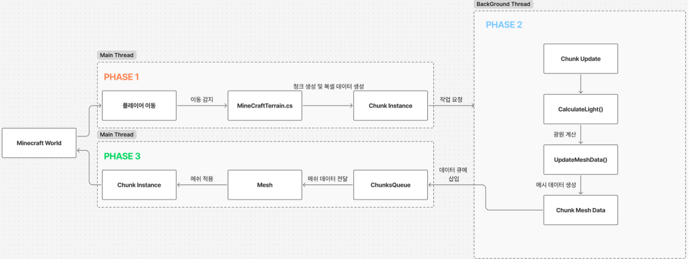
**MinecraftTerrain.cs**
```csharp
private async UniTask ThreadedUpdate(CancellationToken ct)
{
    while (!ct.IsCancellationRequested)
    {
        if (!_isRunningModification)
            ApplyModifications();
        //백그라운드 스레드 진입 -> UpdateChunk()함수에서 무거운 계산.
        if (ChunksToUpdate.Count > 0)
            await UniTask.RunOnThreadPool(() => UpdateChunk(), cancellationToken: ct);
        //과도한 CPU 점유를 방지하고, 대량 생성 시 작업을 쪼개서 시간 축으로 분산
        await UniTask.Delay(10, cancellationToken: ct);
    }
}
```
이 함수 자체는 메인 스레드에서 실행되지만. RunOnThreadPool 구간만 백그라운드 스레드로 나갔다가, await 뒤에는 다시 메인 루프로 이루어집니다.


**Chunk.cs -> UpdateChunk()**
```csharp
ClearChunk();        // 내부 버퍼(List들) 비우고 재사용
CalculateLight();    // 스카이라이트: 컬럼 스캔 + 6방향 전파(BFS)
for (y,x,z)          // 보셀 전수
  if (Block is Solid)
    UpdateMeshData(pos);   // 이웃 검사로 Face Culling → 정점/인덱스/UV/노멀/컬러 쌓기
MinecraftTerrain.Instance.ChunksQueue.Enqueue(this);  // 결과를 메인용 큐로
```
상단의 코드는 UpdateChunk() 즉 백그라운드 스레드에서 일어나는 주요 연산(함수)들이다.

**MinecraftTerrain.cs**
```csharp
private void Update()
{
    ...
    if (ChunksQueue.Count > 0)
        ChunksQueue.Dequeue().CreateMesh();
    ...
}
```
**Chunk.cs**
```csharp
public void CreateMesh()
{
    Mesh mesh = new();
    mesh.vertices = _vertices.ToArray();
    mesh.subMeshCount = 3;
    
    mesh.SetTriangles(_indices.ToArray(), 0);
    mesh.SetTriangles(_transparentIndices.ToArray(), 1);
    mesh.SetTriangles(_leaveIndices.ToArray(), 2);
    
    mesh.uv = _uvs.ToArray();
    mesh.colors = _colors.ToArray();
    mesh.normals = _normals.ToArray();
    _meshFilter.mesh = mesh;    
    _meshCollider.sharedMesh = _meshFilter.mesh;
    
}
```
백그라운드에서 연산이 끝난 후 담겨있는 ChunksQueue에 있는 정보를 통해 메인스레드에서 CreateMesh()를 하여 메쉬 생성

Unity API는 엔진이 메인 스레드에서 정해진 순서로 상태를 관리하기 때문에 메인 스레드에서만 접근

## UniTask를 사용해 구현한 이유

이 프로젝트는 "계산은 백그라운드, 적용은 정확한 PlayerLoop 타이밍을 메인"이 필수였다. 여기에 수명/취소 안전과 낮은 GC, 간결한 코드까지 요구되었다.

UniTask는 이 네가지를 가장 적은 위험과 비용으로 동시에 만족시켜, 렌더링을 프레임 스파이크 없이 구현하게 해준다.

# 더 나아가서 고민해볼것

실제 마인크래프트 역시 버전이 업그레이드되면서 지형 생성 방식이 발전해왔다.

구버전에서는 Perlin Noise 기반의 간단한 노이즈 시스템을 사용했지만, 최신 버전에서는 Multi-Noise 기반의 Density Function 구조로 완전히 전환되며 훨씬 자연스럽고 다양성 있는 지형을 만들어낸다.

또한 그 과정에서 메싱 최적화, 청크 병렬 생성, 조명 계산 개선 등 수많은 최적화 기술들이 도입되었다.

이 프로젝트에서 사용한 방식 외에도 최신 기법과 다양한 접근 방식들이 존재하므로, 

더 폭넓게 리서치한 뒤 상황에 맞는 가장 합리적인 기술을 선택하는 것이 중요하다고 생각한다.
